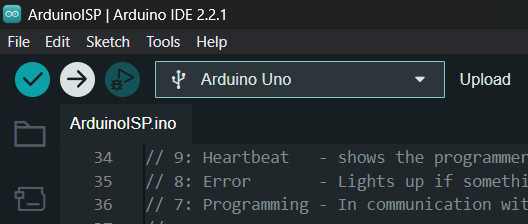
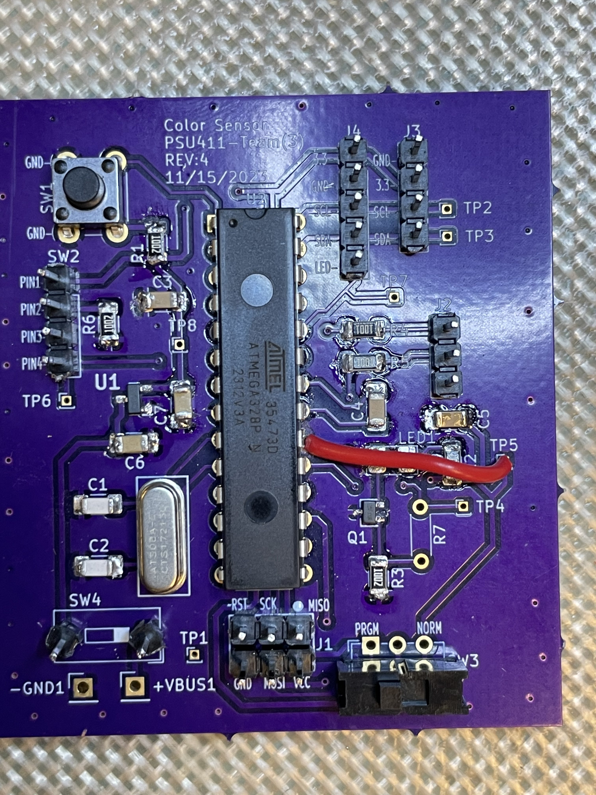
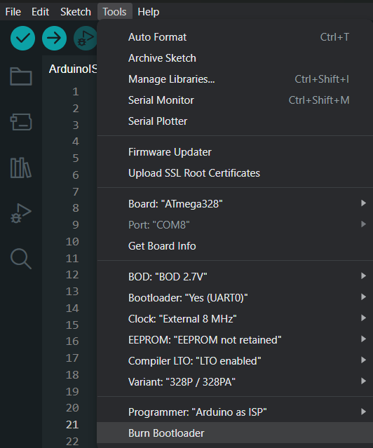

# ECE-411-Practicum
ECE-411-Practicum Project
---
## Color Sensor State Diagram

## Bootload and Programming
**Library for Bootload Raw Chip:** https://github.com/MCUdude/
MiniCore

**1.) Add "https://mcudude.github.io/MiniCore/package_MCUdude_MiniCore_index.json" to Arduino IDE's "Additional boards manager URL's"**

---
**2.) Open example project "AruinoISP"**

---
**3.) Program Arduino Uno for programming by clicking "Upload button" with the Aruino Uno board selected. Also in the "Tools" tab select "ArduinoISP" for programmer** 

---
**4.) Make connections from Aruduino Uno to PCB. On PCB, move bottem left switch to Program Mode (PRGM) by sliding the switch to the left**

| Arduino Uno |->| PCB |
|-------------|--|-----|
|5V           |->|VCC  | 
|GND          |->|GND  |
|13           |->|CLK  |
|12           |->|MISO |
|11           |->|MOSI |
|10           |->|Reset|

---
**5.) Bootload ATmega328 by opening "Tools tab and clicking "Burn Bootloader" after changing the settings to the ones seen below.**  
Board: "ATmega328"
BOD: 2.7V  
Clock: "External 8MHz"  
EEPROM: "EEPROM not retained"  (Not Necessary, For Clearing Color Calibration data)  
Variant: "328P/32PA"  
Programmer: "Arduino as ISP"  

---
**6.) Switch to RGB_Sensor_Project.ino ("ECE-411-Practicum/RGB_sensor_project/RGB_sensor_project.ino"). Open Tools tab and make sure "Programmer" is set to "Arduino as ISP".With the ATmega328 board selected, open the "Sketch" tab and click "Upload Using Programmer"**

---
**7.) Unplug Programming connectings to PCB and flip the bottom right switch on the PCB to "NORM" mode. Make sure the PCB is getting power from the batter to the PCB. If this is the firt time programming the device the OLED should show that it's entering calibration mode.**  

**NOTE:** After first bootload you don't need to do it again for that chip. If you want to upload a new Schetch to the chip you only need to flip bottem left switch to PRGM, make the right programming connections, and then go straight to step 6.

